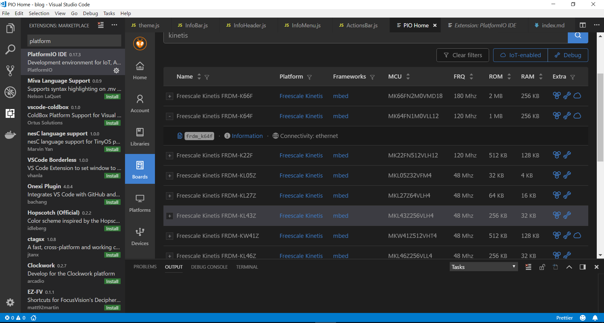

[PlatformIO](https://platformio.org) is a framework, written in python, which turns your favourite (web) code editor into an embedded programming IDE. Not a VSCode fan? PlatformIO can just as well be used with the Atom editor, and there's even integration with other popular desktop (e.g. Eclipse) and cloud IDE's.

 It will add much-wanted features such as debugging, serial port monitoring, etc. to your editor. It has a nice library manager which will make it easy to find/install/update libraries (e.g. a MQTT library).



## A first (blink) test
As a first test, to ensure connectivity with the board is fine and debugging works, let's make a LED blink. Start at the platformIO home page and click "new project". Then select the board you want to use (in my case: *Freescale Kinetis FRDM-K64F*) and press "Finish".

Your new project will consist of these files:
* *.pioenvs/*: build dir (firmware file, upload file, framework libraries, etc.)
* *.vscode/*: VS Code settings: debug, paths, ...
* *lib/*: project-specific libraries
* *src/*: project code
* *platformio.ini*: Project config

  > Optional: I am using a different debug tool. I have the Segger J-Link firmware for OpenSDAv2 installed on my kinetis board (instead of the existing mbed OpenSDAv2 firmware), for convenient use with Eclipse / Kinetis Design Studio. Therefor I need to add these lines to the settings in `platformio.ini`:
  >  ```
  >  debug_tool = jlink
  >  upload_protocol = jlink
  >  ```
  > Read more about the advantages of this alternative debugging firmware (over the standard mbed bootloader) [here] (https://mcuoneclipse.com/2014/04/27/segger-j-link-firmware-for-opensdav2/)
  > If you use the default mbed bootloader, you should be fine though.

Change the main file (`src/main.cpp`) to blink a LED:
```C
#include <mbed.h>

DigitalOut myled(LED1);

int main() {
    while(1) {
        myled = 1;
        wait(1);
        myled = 0;
        wait(1);
    }
}
```
The project is very concise, we didn't have to make any mappings to hardware, since we're relying the "mbed" libraries, which is the "framework" in platformIO lingo.

A VS Code debug configuration was automatically created along with the project. Set a debug point if you want, then press the *debug* icon on the left, and launch it.

## PlatformIO's build system

PlatformIO does not use Make files. Instead it uses **SCons**, a cross-platform build tool based on Python. The SCons command will be built starting from your `platformio.ini`, which is currently only a few lines long:
```
[env:frdm_k64f]
platform = freescalekinetis
board = frdm_k64f
framework = mbed
debug_tool = jlink
upload_protocol = jlink
```
The platform, board and framework determine which libraries will be used (freescale libraries, mbed libraries, `startup_MK64F12.o`, etc). As previously mentioned I have added JLink as an upload/debug tool. Take a look at the board definition file `frdm_k64f.json`, which carries build, debug and upload information:
```json
{
  "build": {
    "cpu": "cortex-m4",
    "f_cpu": "120000000L",
    "mcu": "mk64fn1m0vll12"
  },
  "connectivity": [
    "ethernet"
  ],
  "debug": {
    "jlink_device": "MK64FN1M0xxx12",
    "pyocd_target": "k64f",
    "svd_path": "MK64F12.svd"
  },
  "frameworks": [
    "mbed"
  ],
  "name": "Freescale Kinetis FRDM-K64F",
  "upload": {
    "maximum_ram_size": 262144,
    "maximum_size": 1048576,
    "protocol": "mbed",
    "protocols": [
      "cmsis-dap",
      "jlink",
      "mbed"
    ]
  },
  "url": "https://developer.mbed.org/platforms/FRDM-K64F/",
  "vendor": "Freescale"
}
```

When building, the PlatformIO executable is called, which in turn will call SCons, using the provided parameters and referencing the main build script file: `main.py`. Take a look at it's base template:

```python
"""
    Build script for test.py
    test-builder.py
"""

from os.path import join
from SCons.Script import AlwaysBuild, Builder, Default, DefaultEnvironment

env = DefaultEnvironment()

# A full list with the available variables
# http://www.scons.org/doc/production/HTML/scons-user.html#app-variables
env.Replace(
    AR="ar",
    AS="gcc",
    CC="gcc",
    CXX="g++",
    OBJCOPY="objcopy",
    RANLIB="ranlib",

    ARFLAGS=["..."],

    ASFLAGS=["flag1", "flag2", "flagN"],
    CCFLAGS=["flag1", "flag2", "flagN"],
    CXXFLAGS=["flag1", "flag2", "flagN"],
    LINKFLAGS=["flag1", "flag2", "flagN"],

    CPPDEFINES=["DEFINE_1", "DEFINE=2", "DEFINE_N"],

    LIBS=["additional", "libs", "here"],

    UPLOADER=join("$PIOPACKAGES_DIR", "tool-bar", "uploader"),
    UPLOADCMD="$UPLOADER $SOURCES"
)

env.Append(
    BUILDERS=dict(
        ElfToBin=Builder(
            action=" ".join([
                "$OBJCOPY",
                "-O",
                "binary",
                "$SOURCES",
                "$TARGET"]),
            suffix=".bin"
        )
    )
)

# The source code of "platformio-build-tool" is here
# https://github.com/platformio/platformio-core/blob/develop/platformio/builder/tools/platformio.py

#
# Target: Build executable and linkable firmware
#
target_elf = env.BuildProgram()

#
# Target: Build the .bin file
#
target_bin = env.ElfToBin(join("$BUILD_DIR", "firmware"), target_elf)

#
# Target: Upload firmware
#
upload = env.Alias(["upload"], target_bin, "$UPLOADCMD")
AlwaysBuild(upload)

#
# Target: Define targets
#
Default(target_bin)
```

The terminal output when building shows us the libraries in the mbed "framework". The Freescale drives `fsl_*` should look familiar if you've programmed Kinetis boards before.

## Can I convert my existing embedded project to use platformIO?
Killer question. It should be possible, but depending on your current codebase/project this might be easy or quite hard. You could make your own development platform definition (a `manifest.json` and `main.py`) and board definition (`myboard.json`). For examples, take a look at the [github repository]().

### Yes, but should you?
You'd like to use a modern editor for your embedded project. PlatformIO is not the only way to achieve this. If your plan on keeping your directory structure, your own libraries and makefiles, you might not need/want platformIO. It might just be easier to open your existing code, and create a working launch (debug) config.

Essentially you just want to stitch the VS Code launch config to GDB. The [Cortex-Debug](https://marketplace.visualstudio.com/items?itemName=marus25.cortex-debug) extension can help you create the right launch configuration. The following launch configuration works fine with my Kinetis board:
```json
{
    "version": "0.2.0",
    "configurations": [
        {
            "type": "cortex-debug",
            "request": "launch",
            "servertype": "jlink",
            "cwd": "${workspaceRoot}",
            "executable": "<full-path>/firmware.elf",
            "name": "Debug J-Link",
            "device": "MK64FN1M0xxx12",
            "interface": "swd",
        }
    ]
}
```
  > I did have to set the `cortex-debug.JLinkGDBServerPath` and `cortex-debug.armToolchainPath` in workspace settings, but if the GDB and arm-eabi executables are in your system path you should be fine.

Debugging is not the only thing you want though (but it's a biggie). Other things you might want:
* A serial monitor: check out [this extension](https://marketplace.visualstudio.com/items?itemName=olback.vscode-serial)?
  > You could use PlatformIO's monitor, but platformIO does take some time to load at startup. So if all you're going to use is the serial monitor, why go bulky?

* Building and flashing support, instellisense, ...
  > Update: check out my other post about Embedded VS Code development (without PlatformIO)

## Conclusion
PlatformIO is perfect if you're a hobbyist and you're just starting a new project. It will get you started fast, providing you with clean library and code management. If you have an existing project, it might not be trivial to convert to platformIO (using the platformIO board and framework definitions). You might then be better off configuring some extension(s) for debugging, serial console, etc. to fit your codebase.
