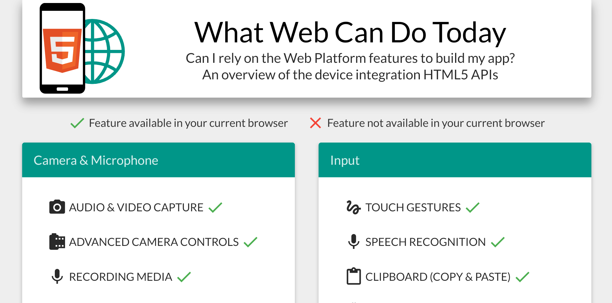

Short answer: they're websites (/ "web apps") with some extra functionality. The extra functionality can be offline availability, "native" device features (e.g. push messages, GPS, etc.), ability to install the app. The following blogpost can serve as a short introduction to the concept of PWA's.

## What's a PWA?

A PWA is a website / web app that aims to deliver an experience similar to a native (mobile or desktop) application, by making it offline available, triggering native device features etc. When visiting it using your browser, you can add it to your homescreen and it will seem to function like a regular app. (not just a bookmark!) Some characteristics are:

* **Responsive**: Fit any form factor

* **Installable** and **Offline available**: Through the use of service workers

* **Secure**: served via HTTPS

* **Re-engageable**: e.g. through push notifications

For an overview of some example PWA's, take a look at [here](https://pwa.rocks/). Some popular services/apps have released PWA versions, twitter lite for example.

## Comparison with mobile apps

> Let's compare with mobile apps created using web concepts such as Cordova/PhoneGap.
> Compared to native mobile apps there is of course also the element of performance.

PWA pro's:
+ Easily linkable (through a URL)
+ Easily installable (without an app store)
+ More cross-platform

PWA weaknesses:
- Communication between apps (mobile apps can talk to other apps)
- No app store: app stores can be a very convenient utility for finding different apps. There might be app stores for PWA's as well though, or they might get integrated in to app stores, TBD...
- Less device API support
  + e.g. GPS can be accessed, but *geofencing* is not yet possible for PWA's
  > On the account of native API access, there might be more support than you suspect. Check out [whatwebcando.today](https://whatwebcando.today/) using your mobile browser to find out what's supported on your phone. For chrome on android for example, there's support for push notifications, bluetooth, GPS, VR and AR, etc.


## Not just mobile

Chrome has experimental support for PWA. You can enable it at chrome://flags/#enable-desktop-pwas 

## How to set up your PWA

You will have to set up a **manifest file** (and link to it from your index page). This can be `manifest.json` or `manifest.webmanifest`. The manifest file defines various PWA settings. One is an app icon, preferably provided in different sizes. Check out the manifest file for this blog:

```json
{
  "name": "Dev sidetracks",
  "short_name": "BlogWim",
  "start_url": "/blog/index.html",
  "background_color": "#111",
  "theme_color": "#111",
  "display": "standalone",
  "icons": [
    {"src":"/icons/icon-48x48.png", "sizes":"48x48","type":"image/png"},
    {"src":"/icons/icon-96x96.png","sizes":"96x96","type":"image/png"},
    {"src":"/icons/icon-144x144.png","sizes":"144x144","type":"image/png"},
    {"src":"/icons/icon-192x192.png","sizes":"192x192","type":"image/png"},
    {"src":"/icons/icon-256x256.png","sizes":"256x256","type":"image/png"},
    {"src":"/icons/icon-384x384.png","sizes":"384x384","type":"image/png"},
    {"src":"/icons/icon-512x512.png","sizes":"512x512","type":"image/png"}
    ]
}
```
A manifest file can easily be generated using a plugin for e.g. Gatsby (this blog) or Webpack etc. Or using a tool such as this [Web App manifest generator](https://app-manifest.firebaseapp.com/).

Next, you need to register a **service worker**. Depending on the framework you might already be using, there could just be a plugin readily availble. For webpack, you can use a [plugin](https://github.com/GoogleChromeLabs/sw-precache). Vue CLI 3 has the following handy plugin: `@vue/cli-plugin-pwa`.

All PWA's have to be served over **HTTPS**, so you'll need to get that SSL certificate set up ([Let's Encrypt](https://letsencrypt.org/) is a convenient option). This is because a PWA relies on service workers. These are scripts which are run not on the server or on the client (it can't access the DOM) but in the background by your browser, separate from web pages. They open the door to features that don't need a web page or user interaction. You can do powerful things using service workers. So to prevent abuse, through e.g. man-in-the-middle attacks, webapps can only be served over HTTPS.

If you adhere to the requirements mentioned above, you should have a functional PWA. But when opening your web page not much will seem to have changed. In order to also show an **install banner** in chrome, you have to [listen to the event "beforeinstallprompt"](https://developers.google.com/web/fundamentals/app-install-banners/#listen_for_beforeinstallprompt) to trigger the banner (or any element on your website, really). In chrome 67, this banner was generated automatically, but this feature was removed. As for IOS, there are some IOS-specific meta tags to tweak your PWA with.

These are the constituting elements of a PWA. As for best practises, check out [Google's PWA checklist](https://developers.google.com/web/progressive-web-apps/checklist)

## Conclusion

Are you excited yet about PWA's? I know I am. If the HTML5 device feature API integration continues to grow (keep checking [what web can do](https://whatwebcando.today/)!), PWA's will be a viable solution for more and more projects. These apps can provide a very convenient way to implement and serve your app across many platforms using a single codebase. I think and hope they will be included (mobile and desktop) app stores.
